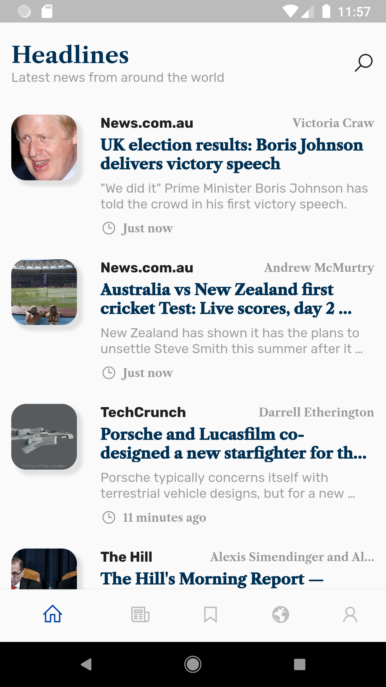

# news_me

A news application built with flutter using https://newsapi.org as a news source

## Getting Started

To clone this project, run the `git clone https://github.com/mr-tackie/flutter_news.git` command in the command line.

## To Do
1. Work on bookmarks
2. Implement RxDart for state management

## Screenshots
   
